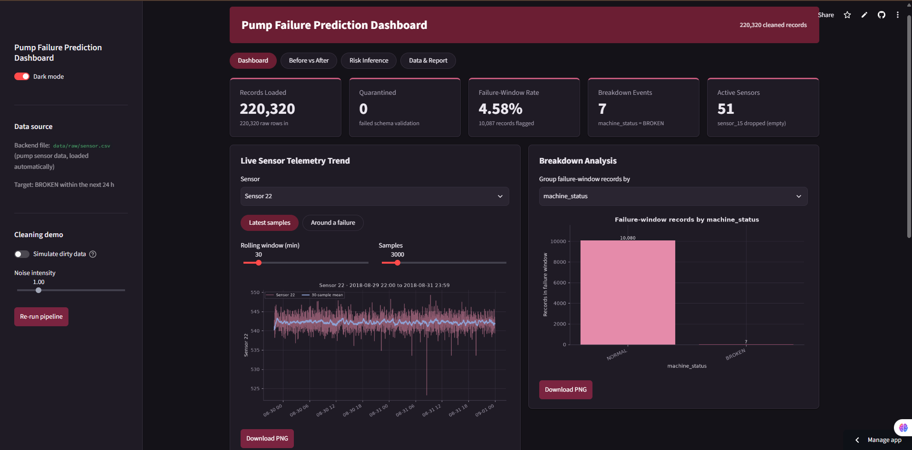
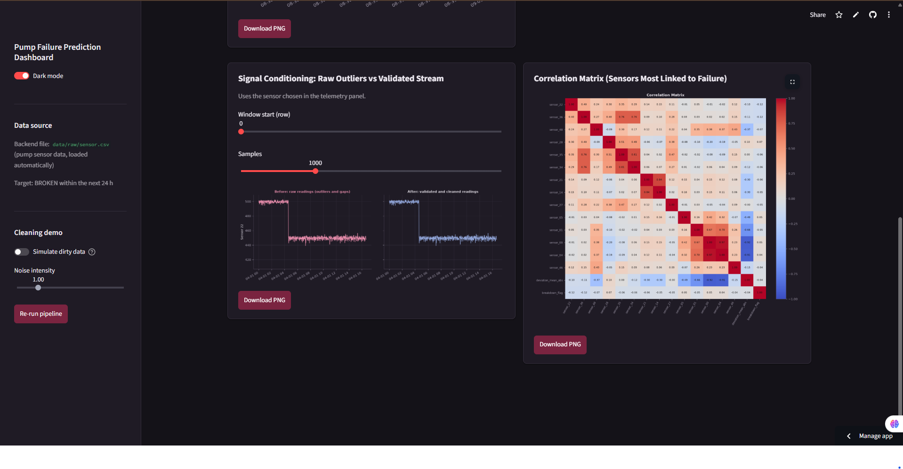
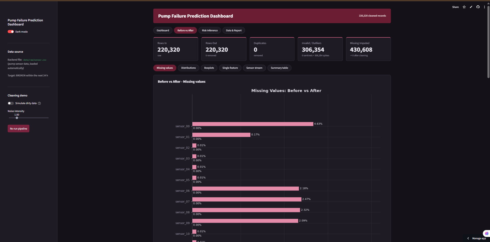
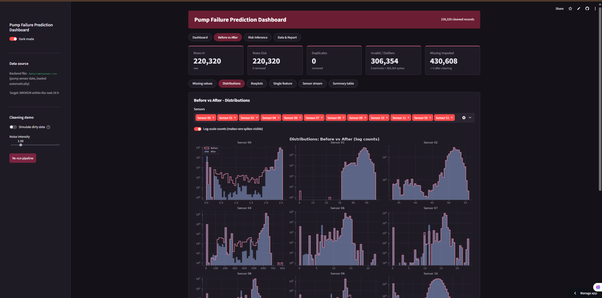
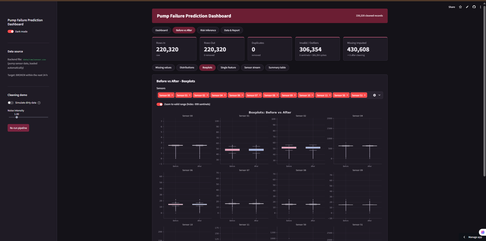
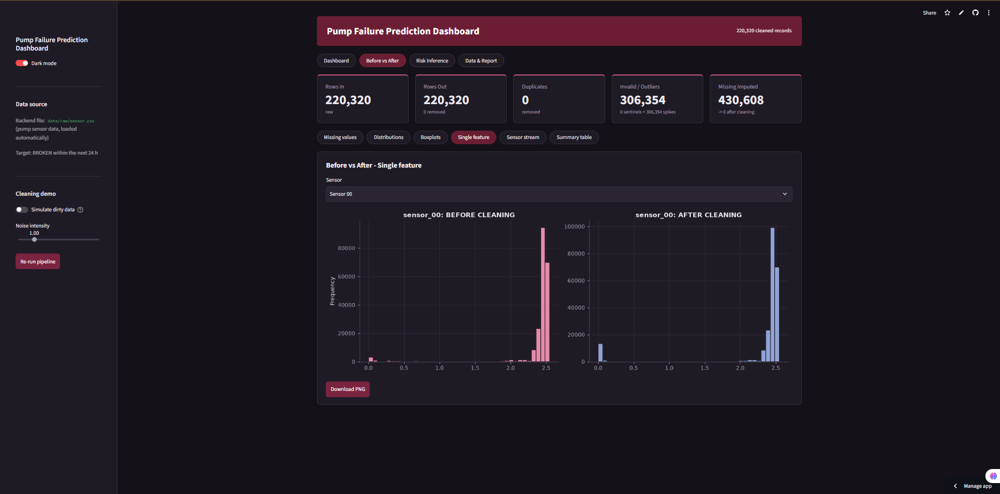
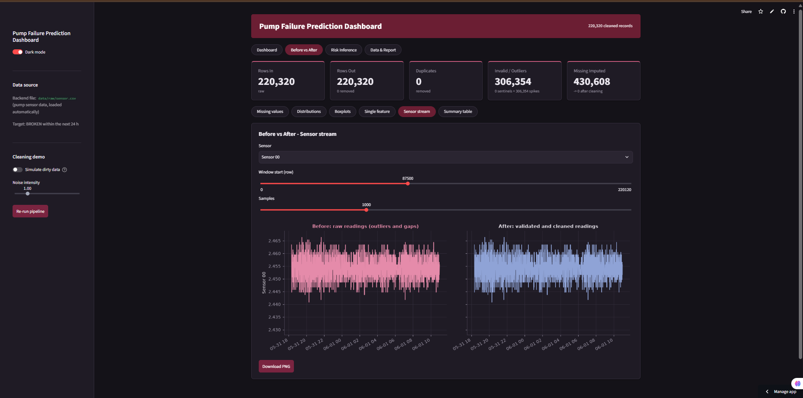
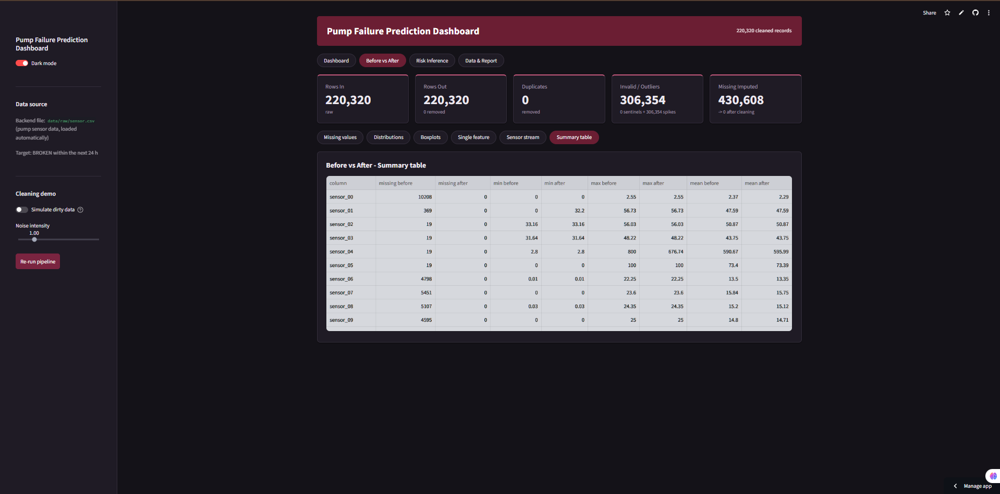
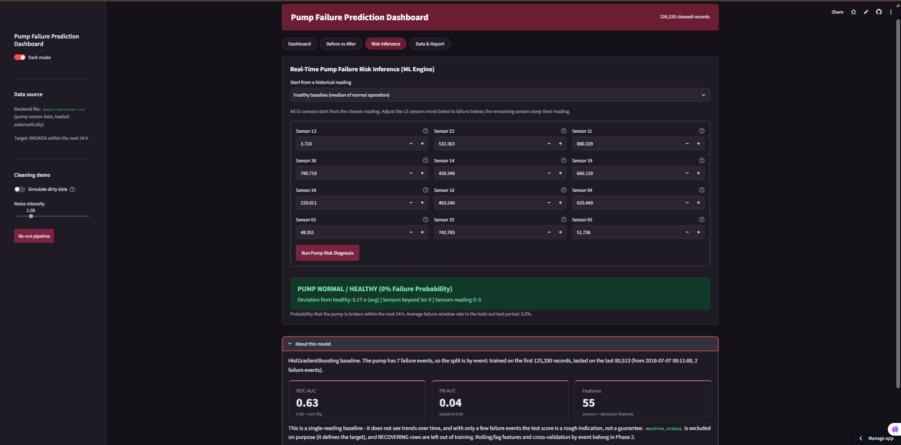
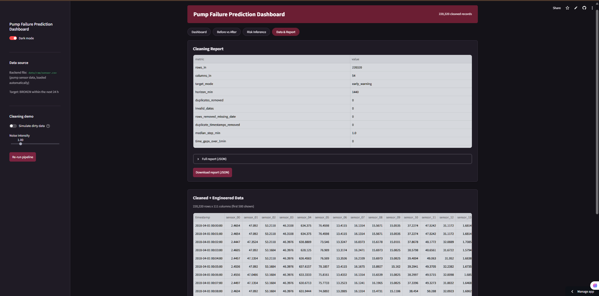

<div align="center">

# Predictive Maintenance and Machine Failure Prediction System

**Phase 1: ETL + EDA pipeline, baseline failure-risk model and Streamlit dashboard**

Programming for AI · Section C, Artificial Intelligence · Team **NEXORA**

[](https://machine-failure-prediction-system-pumpsensor.streamlit.app/)


**[Open the live dashboard](https://machine-failure-prediction-system-pumpsensor.streamlit.app/)**



</div>

An end-to-end pipeline that turns raw industrial pump telemetry into validated, feature-engineered data, explores it with before / after analysis, and estimates the probability that the pump breaks within the next 24 hours. Everything runs inside one Streamlit application: the pipeline starts automatically when the app opens, and the dataset stays in the project backend (no upload needed).

---

## Table of Contents

1. [Features](#features)
2. [Dataset](#dataset)
3. [Project Structure](#project-structure)
4. [Quick Start](#quick-start)
5. [How the Pipeline Works](#how-the-pipeline-works)
6. [Dashboard Pages](#dashboard-pages)
7. [Results](#results)
8. [Configuration](#configuration)
9. [Baseline Model](#baseline-model)
10. [Limitations and Planned Improvements](#limitations-and-planned-improvements)
11. [Deployment](#deployment)
12. [Troubleshooting](#troubleshooting)
13. [Roadmap](#roadmap)
14. [Team](#team)

---

## Features

- **Automated ETL**: extract, clean, validate, engineer features and load, in one call (`run_pipeline`).
- **Time-series-aware cleaning**: dead-sensor removal, sentinel handling, duplicate timestamps, status-aware outlier rules and gap imputation.
- **Strict validation**: every row is checked against a Pydantic v2 contract; failing rows are **quarantined with the reason**, never silently dropped.
- **Healthy-baseline features**: per-sensor z-scores, deviation scores and rolling statistics that make 51 differently scaled sensors comparable.
- **Before / after EDA**: missing values, distributions, boxplots, single-sensor and raw-versus-clean stream comparisons.
- **Interactive dashboard**: light / dark theme, KPI cards, telemetry around failures, PNG / JSON / CSV downloads, and a failure-risk inference page.
- **Persistence**: processed CSV and SQLite database of the final dataset.

## Dataset

| | |
|---|---|
| **Source** | Kaggle: [Pump Sensor Data](https://www.kaggle.com/datasets/nphantawee/pump-sensor-data) (`nphantawee/pump-sensor-data`) |
| **File** | `sensor.csv` (about 120 MB) |
| **Size** | 220,320 records, one reading per minute (April to August 2018), one industrial pump |
| **Columns** | `timestamp`, `sensor_00` … `sensor_51` (52 anonymous channels), `machine_status` |
| **Status values** | `NORMAL`, `RECOVERING`, `BROKEN` (only 7 `BROKEN` rows) |
| **Known issues** | `sensor_15` is completely empty; `sensor_50` is missing roughly a third of its values; scattered gaps elsewhere |

### Target variable

The file has no ready-made label, and 7 failures are far too few to train on directly. The pipeline therefore creates `breakdown_flag`:

| Mode (`TARGET_MODE`) | Meaning |
|---|---|
| `early_warning` *(default)* | `1` if a `BROKEN` event occurs within the next `HORIZON_MIN` minutes (default 1440 = 24 h) |
| `abnormal_state` | `1` if the status is `BROKEN` or `RECOVERING` (easier, detects a state rather than predicting) |

With the default settings, **10,087 of 220,320 records (4.58 %)** fall inside a failure window. `machine_status` is **never** used as a model input because it defines the target.

## Project Structure

```
pump_project/
├── .devcontainer/          # dev container config (VS Code / GitHub Codespaces)
├── .gitattributes          # Git attributes (e.g. LFS tracking for the large CSV)
├── .gitignore
├── LICENSE
├── README.md
├── app.py                  # Streamlit dashboard (entry point)
├── requirements.txt
├── docs/
│   └── screenshots/        # images used in this README
├── data/
│   ├── raw/
│   │   └── sensor.csv      # Kaggle pump dataset (loaded automatically)
│   ├── processed/          # clean_features.csv (created on save)
│   └── maintenance.db      # SQLite database (created on save)
├── outputs/
│   └── plots/              # PNG plots written by `python -m src.pipeline`
└── src/
    ├── __init__.py
    ├── config.py           # paths, columns, target mode, cleaning and feature settings
    ├── extract.py          # CSV loading, optional kagglehub download, demo noise injector
    ├── clean.py            # time-series cleaning + target construction
    ├── schemas.py          # Pydantic v2 row contract + quarantine
    ├── features.py         # z-scores, deviation and rolling features
    ├── eda.py              # Matplotlib plots (light / dark themes)
    ├── model.py            # HistGradientBoosting baseline + risk inference
    ├── load.py             # CSV / SQLite persistence
    ├── pipeline.py         # orchestrates the full ETL + EDA run
    └── theme.py            # CSS for the Streamlit dashboard
```

## Quick Start

**Requirements:** Python 3.11+

```bash
# 1. (optional) create a virtual environment
python -m venv .venv
.venv\Scripts\activate          # Windows
# source .venv/bin/activate     # macOS / Linux

# 2. install dependencies
pip install -r requirements.txt

# 3. add the dataset (see below), then start the app
streamlit run app.py
```

Or skip the installation and use the hosted version: **<https://machine-failure-prediction-system-pumpsensor.streamlit.app/>**

### Adding the dataset

Download `sensor.csv` from the [Kaggle page](https://www.kaggle.com/datasets/nphantawee/pump-sensor-data) and place it at:

```
data/raw/sensor.csv
```

If the file is missing and `kagglehub` is installed, the app tries to download it once and copies it there. This may require Kaggle credentials, so a manual download is the most reliable option.

The pipeline runs when the app starts. The first run takes about a minute for 220k rows; later interactions use the cached result. Use **Re-run pipeline** in the sidebar to force a fresh run.

### Command-line run (no Streamlit)

```bash
python -m src.pipeline
```

Runs the full pipeline with demo noise, saves the EDA plots (missing values, distributions, boxplots, correlation, class balance, status distribution) to `outputs/plots/`, writes `data/processed/clean_features.csv` and `data/maintenance.db`, and prints the scalar cleaning-report values.

## How the Pipeline Works

```
sensor.csv ─► Extract ─► Clean ─► Validate (Pydantic) ─► Features ─► Load (CSV / SQLite)
                            │                │                │
                            ▼                ▼                ▼
                       cleaning report   quarantine table   EDA + baseline model
```

1. **Extract** (`extract.py`): reads the CSV, drops the unnamed index column, checks that all 54 expected columns exist. Optionally injects demo noise into a *copy* of the data.
2. **Clean** (`clean.py`):
   - drops dead sensors (`DEAD_SENSORS`), exact duplicate rows and duplicate timestamps; parses and sorts by time
   - standardises `machine_status` and rejects unknown values
   - converts sentinel codes (`-999`) and infinities to missing
   - builds `breakdown_flag`
   - flags outliers with an IQR fence (Q3 + 8 × IQR) **computed and applied on `NORMAL` rows only**, so the extreme readings of `BROKEN` and `RECOVERING` rows are preserved
   - imputes gaps: linear interpolation up to 30 min, then the median of the same machine status, then the global median
3. **Validate** (`schemas.py`): each row must have a valid timestamp, a known status, a 0/1 target and 51 finite sensor values. Failures go to a quarantine table with the reason.
4. **Features** (`features.py`):
   - `<sensor>_z`: z-score against the mean / std of `NORMAL` operation
   - `deviation_mean_abs`, `deviation_max_abs`: average and largest |z| across sensors
   - `n_sensors_beyond_3sd`, `n_zero_sensors`: drift and flat-line indicators
   - `deviation_roll_mean`, `deviation_roll_std`: trailing 60-minute statistics
5. **Load** (`load.py`): writes the final table to `data/processed/clean_features.csv` and the SQLite table `pump_sensor_data`.

The final table has **220,320 rows × 111 columns**: timestamp, 51 sensors, status, target, 6 engineered features and 51 z-scores.

### Demo noise ("Simulate dirty data")

The real file is relatively clean apart from missing values, so the sidebar toggle corrupts a **copy** of the data (dropouts, spikes, `-999` codes, messy status text, duplicate rows) to make the before / after plots meaningful. Corruption is applied to `NORMAL` rows only; the 7 breakdowns and the recovery phases stay untouched. Turn the toggle off to see the real data only (the screenshots below were taken with the toggle off).

## Dashboard Pages

| Page | What it shows |
|---|---|
| **Dashboard** | KPI cards; sensor telemetry with rolling mean (latest samples, or ± N hours around any breakdown); failure-window records by status / month / week / weekday / hour; raw-vs-validated stream; correlation of the sensors most linked to failure |
| **Before vs After** | Missing values, distributions, boxplots, single-sensor comparison, sensor stream, summary table, plus counts of removed rows, duplicates, outliers and imputed values |
| **Risk Inference** | Choose a historical reading (healthy baseline or 2 h before a failure), adjust the 12 most relevant sensors, and get a colour-coded failure probability |
| **Data & Report** | Cleaning report (table, JSON, download), engineered-data preview, CSV sample download, save to CSV / SQLite, quarantined rows |

### Screenshots

**Dashboard**: KPI cards, live telemetry with rolling mean and failure-window breakdown.


**Signal conditioning and correlation**: raw versus validated stream, and the sensors most linked to failure.



**Before vs After**: missing values, distributions and boxplots.

| Missing values | Distributions |
|---|---|
|  |  |



| Single feature | Sensor stream |
|---|---|
|  |  |



**Risk Inference**: editable sensor readings, colour-coded result and model summary.



**Data & Report**: cleaning report and engineered data preview.



## Results

Figures from a run on the full Kaggle file with the default settings (`early_warning`, 24 h horizon, demo noise off).

### Data pipeline

| Metric | Value |
|---|---|
| Records in / out | 220,320 / 220,320 |
| Duplicate rows and timestamps removed | 0 |
| Quarantined rows | 0 |
| Active sensors | 51 (`sensor_15` dropped, empty) |
| Missing values imputed | 430,608 (0 remaining after cleaning) |
| Values replaced by the outlier fence | 306,354 |
| `BROKEN` events | 7 |
| Records inside a failure window | 10,087 (4.58 %) |
| Final table | 220,320 rows × 111 columns |

### Baseline model

| Item | Value |
|---|---|
| Training period | first 125,330 records |
| Test period | last 80,513 records, from 2018-07-07 00:11, containing 2 failure events |
| Features | 55 (51 sensors + 4 single-reading deviation features) |
| ROC-AUC | 0.63 (0.50 = coin flip) |
| PR-AUC | 0.04 (base rate in the test period: 0.04) |

**Reading the numbers honestly:** the baseline is only slightly better than chance and its PR-AUC is about the base rate. With 7 failures in the whole file and 2 in the test set, the score is a rough indication, not a performance claim. The single-reading baseline cannot see trends, which is exactly what Phase 2 addresses (see below).

## Configuration

All settings live in `src/config.py`.

| Setting | Default | Purpose |
|---|---|---|
| `RAW_CSV` | `data/raw/sensor.csv` | Location of the dataset |
| `TARGET_MODE` | `"early_warning"` | `"early_warning"` or `"abnormal_state"` |
| `HORIZON_MIN` | `1440` | Warning horizon in minutes (early-warning mode) |
| `DEAD_SENSORS` | `["sensor_15"]` | Sensors dropped during cleaning |
| `SENTINEL_VALUES` | `[-999.0]` | Codes treated as missing readings |
| `VALID_RANGES` | `{}` | Optional per-sensor limits, e.g. `{"sensor_04": (0, 2000)}` |
| `IQR_MULTIPLIER` | `8.0` | Width of the outlier fence |
| `INTERP_LIMIT_MIN` | `30` | Longest gap (minutes) that is interpolated |
| `ROLL_WINDOW` | `60` | Window for rolling features |
| `TEST_EVENT_FRACTION` | `0.3` | Share of failure events held out for testing |

> If you changed `HORIZON_MIN` or `TARGET_MODE`, click **Re-run pipeline** in the sidebar.

## Baseline Model

`src/model.py` trains a fast **HistGradientBoosting** classifier on the 51 sensors plus four single-reading deviation features, so the dashboard has a live inference engine.

- **Leakage guard:** `machine_status` is excluded; in early-warning mode the `RECOVERING` rows (days after a failure) are left out of training and testing.
- **Event-based split:** with only 7 failures, a plain "last 20 %" split could contain none. The last ~30 % of failure *events* (from the start of their warning window onward) form the test set; there is no shuffling.
- **Metrics:** ROC-AUC, PR-AUC, precision, recall and base rate, shown on the Risk Inference page. Prefer PR-AUC over accuracy for this imbalanced problem.
- **Inference:** the Risk Inference page starts from a historical reading (healthy median or 2 h before a failure), lets you edit the 12 sensors most correlated with failure, recomputes the deviation features and returns a colour-coded result (green below 15 %, amber 15–30 %, red above 30 %).

> **Limitations:** this is a single-reading baseline with no view of trends over time, and a test set with only a couple of failure events gives a rough indication rather than a guarantee. Full modelling (rolling / lag features, cross-validation by event, imbalance handling) belongs to Phase 2.

## Limitations and Planned Improvements

Phase 1 is a working, reproducible foundation. These are the known weak points and how Phase 2 will address them:

| Area | Current behaviour | Planned improvement |
|---|---|---|
| Imputation | Long gaps are filled with the median of the same `machine_status`, which lets the label influence sensor values | Label-independent fill (forward-fill plus a missing-indicator, or training-period median) |
| Statistics | Outlier fences, medians and the z-score baseline are computed on the whole timeline, including the test period | Fit all learned statistics on the training period only |
| Outlier fence | 306,354 values are replaced on the real file; heavy-tailed sensors may lose genuine readings | Per-sensor review and a cap on the share of values a fence may remove |
| Probability | The output is an uncalibrated model score shown as a percentage | Probability calibration and a cost-based alert threshold |
| Evaluation | One split, 2 test failures | Leave-one-event-out cross-validation |
| Validation | Pydantic runs after cleaning over 220k rows (about a minute) and rarely rejects anything | Validate the raw input, use vectorised checks for the bulk data and keep Pydantic for single-record inference |
| Features | Single-reading features only | Rolling, lag and slope features; an unsupervised baseline (PCA / Isolation Forest) |

## Deployment

The app is designed for **Streamlit Community Cloud** and is deployed at **<https://machine-failure-prediction-system-pumpsensor.streamlit.app/>**.

1. Push the project to a GitHub repository.
2. In Streamlit Community Cloud, create a new app from the repository with **main file** `app.py`. Dependencies are read from `requirements.txt`.
3. Provide the dataset. `sensor.csv` (about 120 MB) exceeds GitHub's 100 MB per-file limit, so use one of:
   - **Git LFS** to store `data/raw/sensor.csv` in the repository, or
   - **kagglehub** download at first start, with Kaggle credentials stored in the app's *Secrets*.
4. The pipeline holds a few hundred MB in memory. If the free tier runs short, run the app locally for demonstrations. A sleeping free app may need a few seconds to wake up on the first visit.

## Troubleshooting

| Problem | Fix |
|---|---|
| `Dataset not found at ...` | Put `sensor.csv` in `data/raw/`, or install `kagglehub`. The message shows the exact expected path. |
| `ImportError: cannot import name ...` from `src.*` | An old file is still in `src/`. Replace **all** files in `src/` with the current versions, delete `src/__pycache__`, and restart Streamlit. |
| `Sensors [...] contain no valid values` | A sensor is completely empty in your copy of the data. Add it to `DEAD_SENSORS` in `config.py`. |
| KPI numbers wrap onto two lines | In `theme.py`, set `.kpi .kpi-value` to `font-size: 1.8rem` and add `white-space: nowrap`. |
| Very high outlier count | Check `outliers_replaced` in the report (Data & Report page) and raise `IQR_MULTIPLIER` in `config.py` to widen the fence. |
| Slow first start | Expected: validation and feature engineering over 220k rows take about a minute. The result is cached afterwards. |

## Roadmap

- [x] **Phase 1 (this repository):** ETL, validation, EDA, Streamlit dashboard, baseline risk model.
- [ ] **Phase 2:** scikit-learn modelling: rolling / lag features, cross-validation by failure event, class-imbalance handling, model comparison.
- [ ] **Phase 3:** deep learning with PyTorch and experiment tracking with MLflow.

## Team

Team **NEXORA**, Artificial Intelligence, submitted to Mr. Shaban Satti.

---

*Academic project for the Programming for AI course. Code license: see [LICENSE](LICENSE). The dataset belongs to its Kaggle author; please follow the dataset's terms of use.*